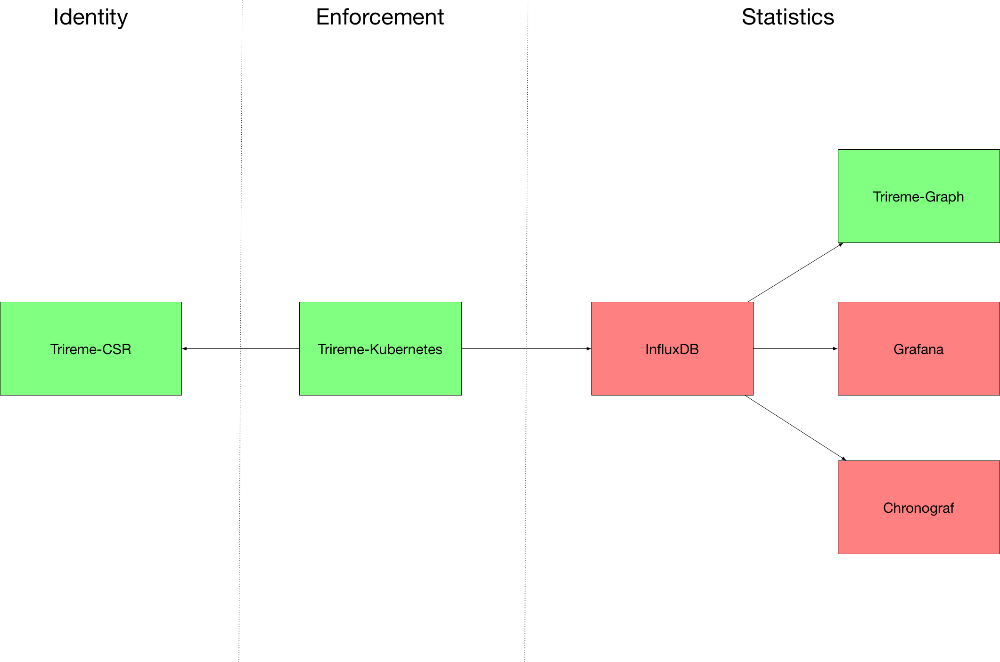
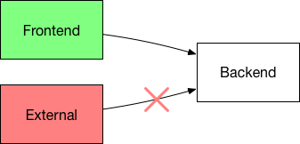

# trireme-kubernetes

[](https://twitter.com/aporeto_trireme) [](https://triremehq.slack.com/messages/general/) [](https://www.apache.org/licenses/LICENSE-2.0) [](https://godoc.org/github.com/aporeto-inc/trireme)
[](https://github.com/igrigorik/ga-beacon)


----

Trireme-Kubernetes is a simple, straightforward implementation of Kubernetes Network Policies. Yet, it is independent from and work with any networking backend.

Trireme-Kubernetes builds upon a powerful concept of identity based on standard Kubernetes tags.

It is based on the [Trireme Zero-Trust library](https://github.com/aporeto-inc/trireme-lib).

----

* [Kubernetes NetworkPolicy definition](https://kubernetes.io/docs/concepts/services-networking/network-policies/)
* [Declare NetworkPolicies](https://kubernetes.io/docs/tasks/administer-cluster/declare-network-policy/)

## Trireme-Kubernetes ecosystem

Trireme-Kubernetes is provided as a bundle with a set of optional addons:



* Trireme-Kubernetes: The enforcement service which police flows based on standard NetworkPolicies defined on Kubernetes API

* [Trireme-CSR](https://github.com/aporeto-inc/trireme-csr): An identity service that is used in order to automatically generate certificates and asymetric keypair for each Trireme-Kubernetes instance

* [Trireme-Statistics](https://github.com/aporeto-inc/trireme-statistics) bundle: Monitoring and statistics bundle that rely on InfluxDB. Flows and Container events can be displayed in either Grafana, Chronograf or a generated graph specifically for Kubernetes flows. Depending on your use-case, some or all of those frontend tools can be deployed.

## Getting started with Trireme-Kubernetes

Trireme-Kubernetes is focused on being simple and Straightforward to deploy.
For any serious deployment, the extensive deployment guide should be followed

This section provides a quick and easy way to try Kubernetes.

If you are using GKE or another system on which you don't have admin access (For RBAC//ABAC), make sure you can configure additional ABAC//RBAC rules.
On GKE, specifically (replace with your account email address):

```
kubectl create clusterrolebinding cluster-admin-binding --clusterrole=cluster-admin --user=your.google.cloud.email@example.org
```

1) Checkout the deployment files:
```
git clone https://github.com/aporeto-inc/trireme-kubernetes.git
cd trireme-kubernetes/deployment
```

2) create the configuration file: (keeping everything by default should be fine)
```
kubectl create -f config.yaml
```

3) Create the Statistic bundle (This will deploy all the possible options):
```
kubectl create -f statistics
```

4) Create a dummy Self-signed `Certificate Authority` for the identity service and adds it as a Kubernetes secret(requires the [tg](https://github.com/aporeto-inc/tg) utility):
```
./gen_pki_ca.sh
```

5) Create the Identity service and finally Trireme-Kubernetes:
```
kubectl create -f trireme
```

At this point, the whole framework is up and running and you can access the Services in order to display your NetworkPolicy metrics:

```
chronograf             ClusterIP      10.43.241.132   <none>          8888/TCP        20h
chronograf-public      LoadBalancer   10.43.254.222   35.194.27.144   80:32153/TCP    20h
grafana                ClusterIP      10.43.241.104   <none>          3000/TCP        20h
grafana-public         LoadBalancer   10.43.241.153   35.194.27.32    80:30716/TCP    20h
graph                  ClusterIP      10.43.248.120   <none>          8080/TCP        20h
graph-public           LoadBalancer   10.43.254.146   35.194.27.212   80:31709/TCP    20h
influxdb               ClusterIP      10.43.245.190   <none>          8086/TCP        20h
```

## Getting started with policy enforcement:

You can test your setup with NetworkPolicies by using an example two-tier application such as [apobeer](https://github.com/aporeto-inc/apobeer)
```
git clone https://github.com/aporeto-inc/apobeer
cd apobeer/kubernetes
kubectl create -f .
```

The deployed [NetworkPolicy](https://github.com/aporeto-inc/apobeer/blob/master/kubernetes/policy.yaml) allows traffic from `frontend` to `backend`, but not from `external` to `backend`




As a result, streaming your logs on any frontend pod should give you a stream of Beers:

```
$ kubectl logs frontend-mffv7 -n beer
The beer of the day is:  "Cantillon Blåbær Lambik"
The beer of the day is:  "Rochefort Trappistes 10"
[...]
```

And as defined by the policy, only `frontend` is able to connect. `external` logs shows that it was unable to connect to `backend`:

```
$ kubectl logs external-bww23 -n beer
```

## Kubernetes and Trireme

Kubernetes does not enforce natively NetworkPolicies and requires a third party solution to do so.

Unlike most of the traditional solutions, Trireme is not tight together with a complex networking solution. It therefore gives you the freedom to use one Networking implementation if needed and another NetworkPolicy provider.

Trireme-kubernetes does not rely on any distributed control-plane or setup (no need to plug into `etcd`). Enforcement is performed directly on every node without any shared state propagation (more info at  [Trireme ](https://github.com/aporeto-inc/trireme))


## Advanced deployment and installation options.

Trireme-Kubernetes [can be deployed](https://github.com/aporeto-inc/trireme-kubernetes/tree/master/deployment) as:

* Fully managed by Kubernetes as a `daemonSet`. (recommended deployment)
* A standalone daemon process on each node.
* A docker container managed outside Kubernetes on each node.

## Prerequisites

* Trireme requires Kubernetes 1.7 for `ingress` policy only use as well as Kubernetes 1.8 for `egress` policy use.
* Trireme requires IPTables with access to the `Mangle` module.
* Trireme requires access to the Docker event API socket (`/var/run/docker.sock` by default)
* Trireme requires privileged access.
* When deploying with the DaemonSet model, Trireme requires access to the in-cluster service API/Token. The Namespaces/Pods/NetworkPolicies must be available as read-only
